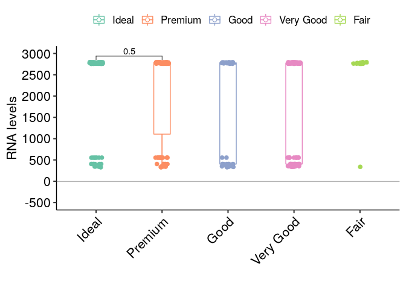

<!-- README.md is generated from README.Rmd. Please edit that file -->

# qPCRplots 

[](https://travis-ci.com/luciorq/qPCRplots)
[](https://ci.appveyor.com/project/luciorq/qPCRplots)
[](https://cran.r-project.org/package=qPCRplots)
[](https://codecov.io/github/luciorq/qPCRplots?branch=master)

## Overview

Package intended in helping process and visualize output from
quantitative polymerase chain reaction experiments.

## Installation

<!--
You can install the released version of qPCRplots from [CRAN](https://CRAN.R-project.org) with:

``` r
## install.packages("qPCRplots")
```
-->

The development version can be installed from
[GitHub](https://github.com/) with:

``` r
# install.packages("remotes")
remotes::install_github("luciorq/qPCRplots")
```

## Example

Execute the Shiny App

``` r
library(qPCRplots)
```

``` r
launch_qpcrplots()
```

``` r
plot_boxplot(df)
#> Warning: Removed 300 rows containing missing values (geom_point).
#> Warning: Removed 9 rows containing missing values (geom_signif).
```



-----

Please note that the ‘qPCRplots’ project is released with a [Contributor
Code of Conduct](CODE_OF_CONDUCT.md). By contributing to this project,
you agree to abide by its terms.
